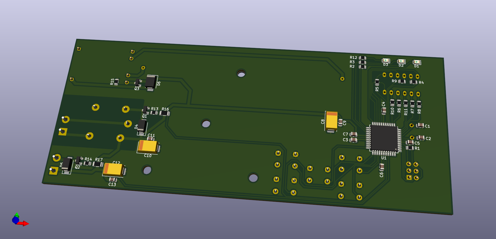
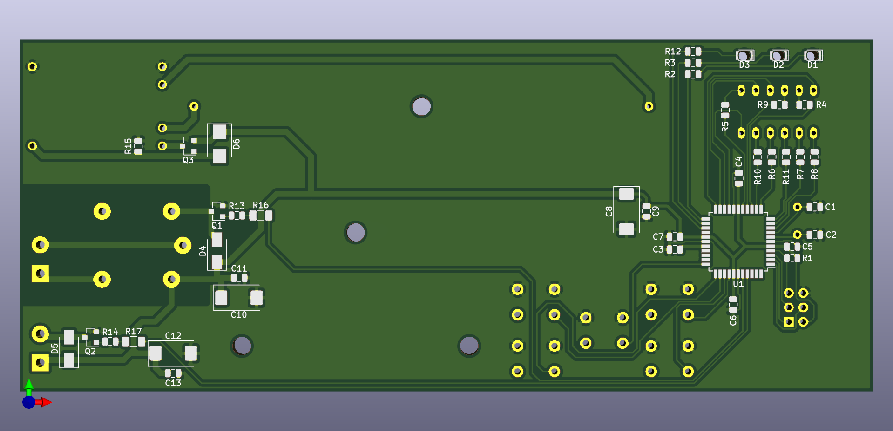
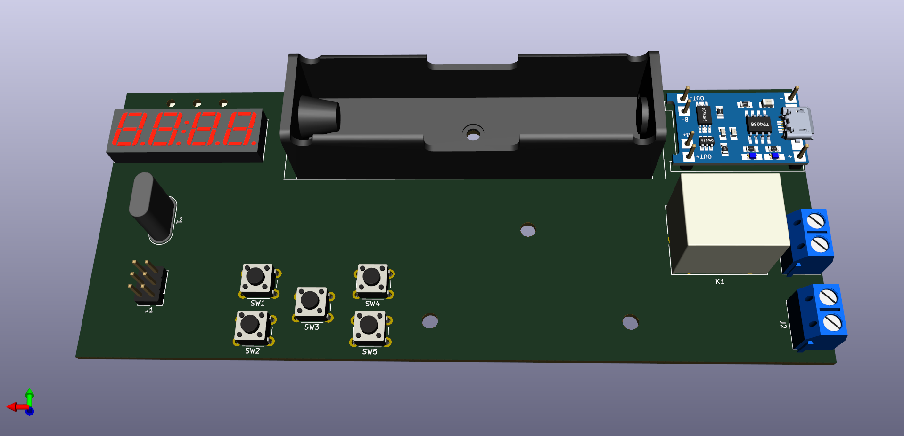
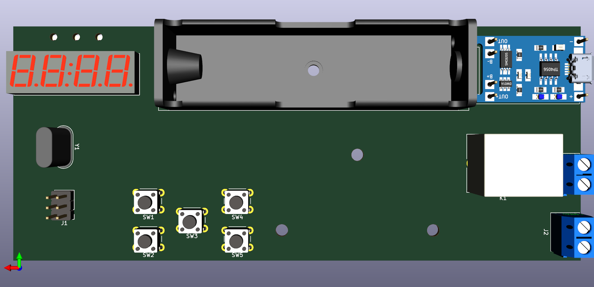
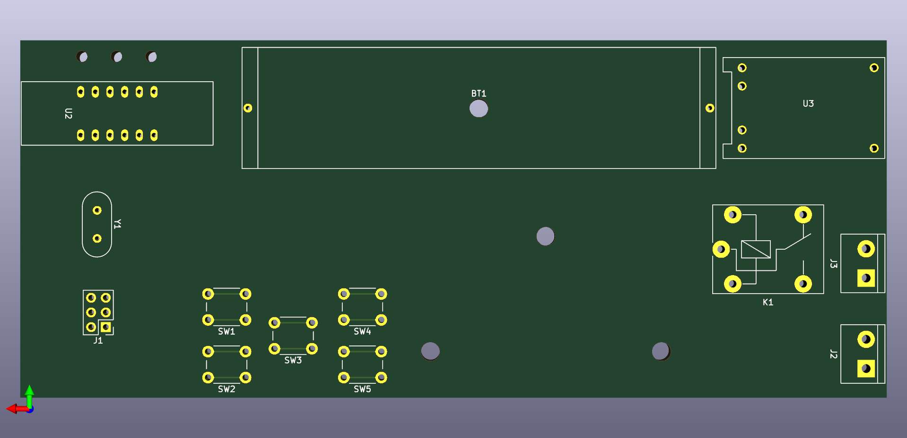
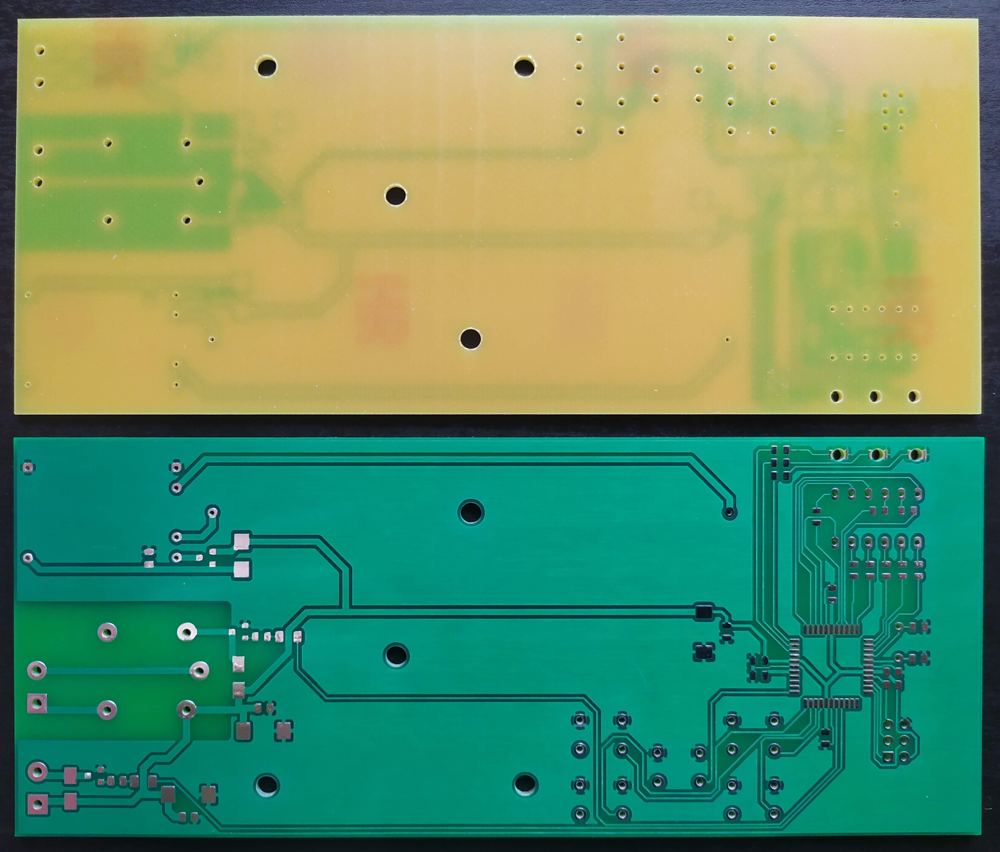

# Plant care system
PCB of the Plant care system

## Board overview

- ATmega32 AVR microcontroller as the heart of the Plant care system
- Terminal block connector for external pump
- Galvanically isolated terminal block connector for external lamp
- AVR ISP connector for AVR programming
- 5V DC input with battery backup:
  - 18650 battery holder for battery operation
  - TP4056 board for battery charging
  - Additional circuitry enabling simultaneous battery charging and system operation
- Microswitch buttons for system parameters setup
- 4-digit 7-segment display for system parameters
- LEDs indicating the currently displayed parameter on 7-segment display

## Images

## External 3D models used in the PCB render

- [TP4056 module](https://grabcad.com/library/03962a-hw107-lithium-battery-charging-module-1)
- [18650 battery holder](https://grabcad.com/library/18650-single-slot-battery-holder-leaded-1)
- [Terminal block](https://grabcad.com/library/degson-dg301-series-5-0mm-terminal-block-pack-1)
